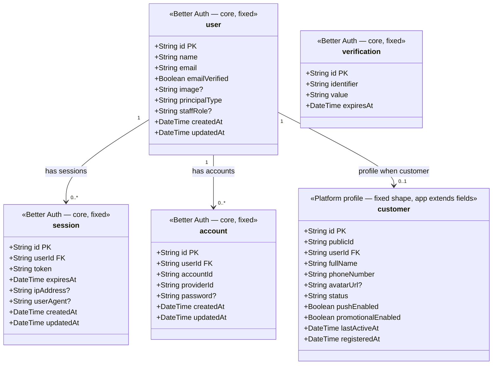
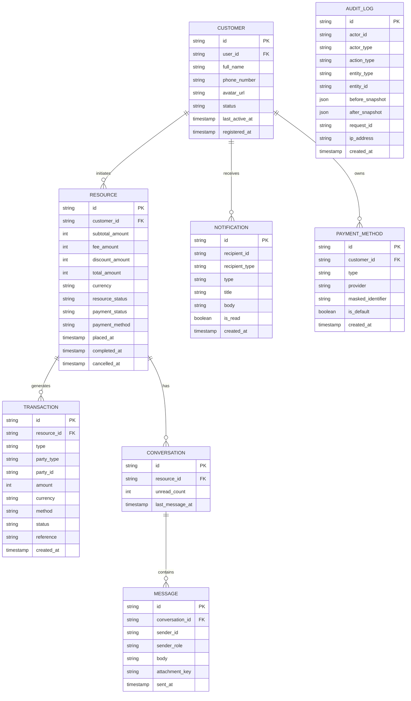
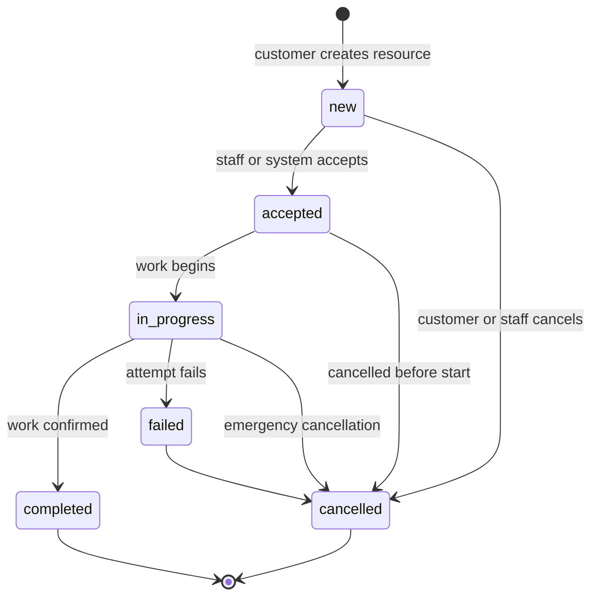
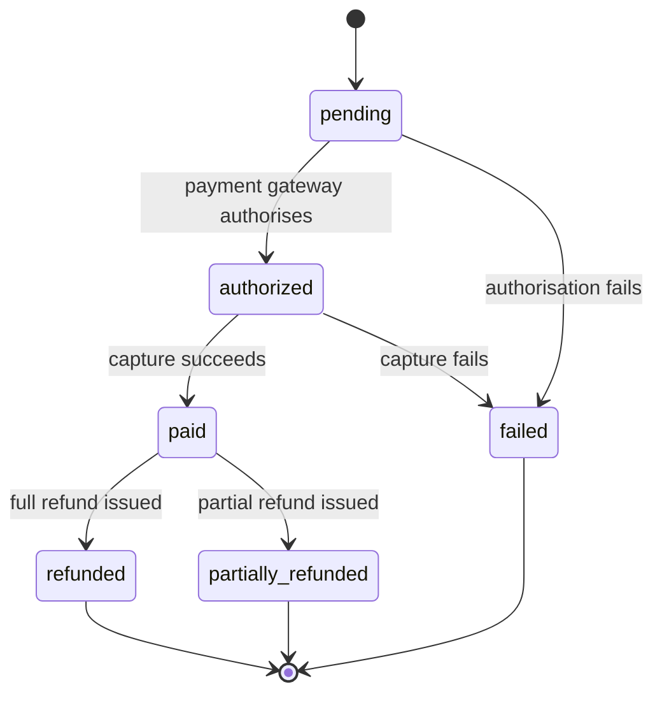

# Platform Template

> **What this is:** a shared architectural template for standing up new platforms on the same backend design. Every section below is the **fixed template** — none of it is tied to any specific application.
>
> **The one module that never changes, regardless of what you build on Tenet, is Authentication & Authorization (Section 3).** Everything domain-specific — the resource being transacted, its lifecycle, its fields — is a pluggable module that a new application defines from scratch using the patterns in Sections 4–8, following the checklist in Section 15.

> **Version:** v1  
> **Base URL:** `https://api.app.com/v1`  
> **Protocol:** HTTPS · JSON  
> **Timestamps:** ISO 8601 UTC  
> **Money:** Integer minor units + explicit currency field  
> **Pagination:** Cursor-based  
> **Principals (fixed):** `customer` · `staff` only

---

## Table of Contents

1. [Platform Overview](#1-platform-overview)
2. [Backend Stack](#2-backend-stack)
3. [Authentication & Authorization (fixed core)](#3-authentication--authorization-fixed-core)
4. [Domain Module Pattern](#4-domain-module-pattern)
5. [State Machine Pattern](#5-state-machine-pattern)
6. [API Conventions](#6-api-conventions)
7. [Route Surface Architecture](#7-route-surface-architecture)
8. [App API — Customer Surface (template)](#8-app-api--customer-surface-template)
9. [Admin API (template)](#9-admin-api-template)
10. [Internal API (template)](#10-internal-api-template)
11. [Realtime Events (template)](#11-realtime-events-template)
12. [Background Jobs (template)](#12-background-jobs-template)
13. [Audit & Compliance](#13-audit--compliance)
14. [Treaty SDK Guidance](#14-treaty-sdk-guidance)
15. [How to Instantiate a New App from This Template](#15-how-to-instantiate-a-new-app-from-this-template)

---

## 1. Platform Overview

Tenet is a shared single-backend template that powers all first-party clients of a given application:

- **customer** — the normal end user (requests a service, places an order, books a resource, manages their account, etc.)
- **staff** — internal operations, finance, support, and platform management

```
┌─────────────────────────────────────────────────────┐
│                    Platform API                      │
│                 https://api.app.com                  │
├─────────────────────────────────────────────────────┤
│           Customer App*          │       Admin       │
│         /v1/app/customer         │     /v1/admin     │
└─────────────────────────────────────────────────────┘
         ↕                                    ↕
┌─────────────────────────────────────────────────────────┐
│            Shared Domain · Shared DB · Shared Auth       │
│              /api/auth/*    /v1/internal/*               │
└─────────────────────────────────────────────────────────┘
```

_\* Multiple customer-side clients can exist (web, mobile, kiosk…), all under `/v1/app/customer/*` and shared `/v1/app/*` services._

**Design principles:**

- One shared domain model, one database, one auth system, one event bus per application.
- Client-specific route groups with principal-specific permission checks.
- Core business logic must not be embedded inside client-only route handlers.
- **The Authentication & Authorization module (Section 3) is identical across every application built on Tenet.** New applications never redesign it — they only add profile columns and permission sets that hang off it.
- Everything else — the transactable resource, its state machine, its fields, its route surface content — is a **domain module** that each application defines independently, following the shape described in Sections 4–8.

**Default principal set is always two:** `customer` and `staff`. Adding further principal types is an explicit extension of Section 3, not part of this template.

---

## 2. Backend Stack

| Concern                 | Technology                         |
| ----------------------- | ---------------------------------- |
| Runtime                 | Bun                                |
| API framework           | Elysia                             |
| Typed client generation | Treaty                             |
| Database                | PostgreSQL                         |
| ORM                     | Drizzle ORM                        |
| Validation / contracts  | TypeBox (via Elysia `t`)           |
| Auth                    | Better Auth                        |
| Cache / queue           | Redis                              |
| Background jobs         | Redis-backed workers (e.g. BullMQ) |
| Object storage          | S3-compatible                      |
| Realtime                | SSE or WebSockets via Elysia       |
| API documentation       | OpenAPI                            |

### 2.1 Backend App Structure

```
apps/api/src/
├─ index.ts
├─ app.ts
├─ env.ts
├─ db/
│  ├─ index.ts
│  ├─ schema.ts                 # re-exports
│  ├─ auth-schema.ts            # fixed — Better Auth tables
│  ├─ platform-schema.ts        # customer + domain tables
│  ├─ rbac-schema.ts            # fixed skeleton
│  └─ lookups.ts
├─ lib/
│  ├─ http.ts                   # fixed — ok() / fail() envelope
│  └─ response-schema.ts        # fixed — TypeBox envelope schemas
├─ plugins/
│  ├─ auth.ts                   # fixed — session derive + scope macro
│  └─ guards/
│     ├─ customer-guard.ts      # fixed
│     └─ staff-guard.ts         # fixed — permission macros
├─ modules/
│  ├─ customer/
│  │  ├─ auth/                  # fixed shape — wrappers around Better Auth
│  │  ├─ profile/               # fixed shape, app-specific fields allowed
│  │  └─ …                      # domain features under customer surface
│  ├─ domain/                   # <-- app-specific: RESOURCE and related logic
│  ├─ uploads/                  # fixed
│  ├─ notifications/            # fixed (when implemented)
│  └─ …                         # chat, analytics, etc. as needed
├─ queues/ / workers/
└─ utils/
   └─ auth.ts                   # fixed — betterAuth() config
```

Only `modules/domain/` (and app-specific columns on `customer` / resource tables) changes between applications. Auth plugins, envelopes, and staff RBAC skeleton are copied as-is.

**Module pattern (fixed):** each feature is typically `routes.ts` + `service.ts`. Services are factory functions with optional dependency injection for tests. Feature groups compose via a barrel (e.g. `customerApp()`).

---

## 3. Authentication & Authorization (fixed core)

This is the one module every application built on Tenet shares. Do not redesign it per application — extend it by adding columns to the customer profile and entries to the staff permission catalog.

### 3.1 Shared Auth Transport

All first-party clients use Better Auth for identity:

```
POST   /api/auth/sign-up/email
POST   /api/auth/sign-in/email
GET    /api/auth/get-session
POST   /api/auth/sign-out
```

The Better Auth handler is mounted on the HTTP app. Role-specific profile records are created **outside** the raw auth transport layer.

**Customer app wrappers (fixed paths):**

```
POST   /v1/app/customer/auth/sign-up
POST   /v1/app/customer/auth/login
```

Staff authenticate via Better Auth sign-in (invitation / out-of-band user creation). There is no public staff self-registration in the template.

### 3.2 Better Auth Schema & Principal Types

Better Auth owns four core tables (`user`, `session`, `account`, `verification`). Platform profiles extend `user` via a `userId` foreign key — they are never stored inside Better Auth’s own tables as nested blobs.

**Fixed principal types on `user`:**

```
principalType: "customer" | "staff"
```

Optional on staff users: `staffRole` (coarse label) and/or RBAC via `user_role` → `role` → `permission` (see Section 3.3).



**How it works in practice (fixed flow):**

1. **Customer sign-up** hits `POST /v1/app/customer/auth/sign-up`. The service forwards to Better Auth `POST /api/auth/sign-up/email` with `principalType: "customer"`, then inserts the `customer` profile row linked via `userId`. On profile failure, clean up the auth user when possible.
2. **Customer login** hits `POST /v1/app/customer/auth/login`, forwards to Better Auth sign-in, then loads the customer profile by `userId`. Missing profile → deny (403).
3. Subsequent requests resolve session via Better Auth `getSession` (headers/cookies). The platform attaches `user` + `session` on the request context.
4. **Customer guard** loads the `customer` row when `principalType === "customer"` and exposes `customerSession: { customerId, userId }`. Protected customer routes require that session (group guard or equivalent).
5. **Scope macro** requires an authenticated user session, then optionally restricts by `principalType` when a list is provided. Shared uploads require a user session only (not domain guards); any authenticated principal may upload.
6. **Staff** users are created out-of-band; `principalType` is `staff`. Staff routes use permission macros (Section 3.3), not the customer profile.
7. The `verification` table is used by Better Auth for email verification and password-reset flows.

Adding app-specific user fields means adding columns to `customer` (or domain tables), never redesigning Better Auth tables or the flows above.

**Auth service result shape (fixed pattern):**

```
{ ok: true, data: T } | { ok: false, error: { status, code, message } }
```

Routes map that to the HTTP envelope (Section 6) and forward `Set-Cookie` from Better Auth when present.

### 3.3 Staff Roles & Permissions (fixed skeleton, permission set is app-defined)

RBAC tables (fixed skeleton): `permission` (resource + action), `role`, `role_permission`, `user_role`.

| Role (example labels) | Intent                                           |
| --------------------- | ------------------------------------------------ |
| `admin`               | All permissions                                  |
| `operations`          | Resources read/update/cancel, dashboard          |
| `finance`             | Transactions, refunds                            |
| `support`             | Resources read/update, users read, notifications |

**Permission catalog pattern (rename the `resources.*` group to the app domain noun):**  
`dashboard.read` · `resources.read` · `resources.update` · `resources.cancel` · `resources.refund` · `users.read` · `transactions.read` · `notifications.read` · `notifications.write` · `settings.read` · `settings.write` · `roles.read` · `roles.write` · `security.read` · `security.write` · `exports.read` · `exports.write`

Staff route macros (fixed pattern):

- Require authenticated user with `principalType === "staff"`
- Check `resource` + `action` against RBAC joins
- Optional in-memory permission cache with invalidation on role changes

---

## 4. Domain Module Pattern

Every application built on Tenet defines exactly one primary **Resource** entity — the thing being transacted (an order, a booking, a listing, a job, an appointment…) — plus a small set of satellite entities that are stable across applications.

When instantiating a new app, rename `RESOURCE` to the domain noun and add domain fields; keep satellite entities and relationships as-is unless a satellite is not needed (then omit it).



**What's fixed vs. app-specific:**

| Entity                                                                   | Status when instantiating a new app                                       |
| ------------------------------------------------------------------------ | ------------------------------------------------------------------------- |
| `CUSTOMER`, staff access via `user` + RBAC                               | Fixed shape (Section 3); add app-specific columns on `customer` only      |
| `RESOURCE`                                                               | App-specific — rename and shape domain fields (geo, scheduling, catalog…) |
| `TRANSACTION`                                                            | Fixed shape; omit if the app has no payments                              |
| `CONVERSATION`, `MESSAGE`, `NOTIFICATION`, `PAYMENT_METHOD`, `AUDIT_LOG` | Fixed pattern; omit modules not needed for the product                    |

Domain business logic lives in `modules/domain/` (and customer-facing services that call into it), **never** only inside thin route handlers.

---

## 5. State Machine Pattern

Two state machines recur across applications. The **shapes** below are fixed; the **resource state names** are renamed per domain when instantiating.

### 5.1 Resource Lifecycle (app-specific state names)



### 5.2 Payment Status (fixed, reused verbatim when payments exist)



---

## 6. API Conventions

### 6.1 Response Envelope (fixed)

```json
{
  "data": {},
  "meta": {
    "requestId": "uuid",
    "timestamp": "2026-01-01T00:00:00.000Z"
  },
  "error": null
}
```

**Paginated list payload (inside `data` or as documented per route):**

```json
{
  "data": {
    "items": [],
    "nextCursor": "cur_abc123",
    "hasMore": true
  },
  "meta": {
    "requestId": "uuid",
    "timestamp": "2026-01-01T00:00:00.000Z"
  },
  "error": null
}
```

**Error response:**

```json
{
  "data": null,
  "meta": {
    "requestId": "uuid",
    "timestamp": "2026-01-01T00:00:00.000Z"
  },
  "error": {
    "code": "VALIDATION_ERROR",
    "message": "One or more fields are invalid.",
    "details": [{ "field": "example.field", "message": "Required." }]
  }
}
```

Helpers (fixed pattern): `ok(data)` and `fail(code, message, details?)`.

### 6.2 Common Query Parameters (fixed)

| Parameter   | Type            | Description           |
| ----------- | --------------- | --------------------- |
| `q`         | string          | Free-text search      |
| `status`    | string          | Filter by status enum |
| `type`      | string          | Filter by type enum   |
| `dateFrom`  | ISO 8601        | Start date filter     |
| `dateTo`    | ISO 8601        | End date filter       |
| `cursor`    | string          | Pagination cursor     |
| `limit`     | integer         | Page size             |
| `sortBy`    | string          | Field to sort by      |
| `sortOrder` | `asc` \| `desc` | Sort direction        |

---

## 7. Route Surface Architecture

```mermaid
graph TD
    subgraph Clients
        CA[Customer App]
        AD[Admin Dashboard]
        WK[Internal Workers]
    end

    subgraph App Surface
        ACS[/v1/app/customer/*]
        ASS[/v1/app/shared/* and /v1/app/uploads/*]
        AUTH[/api/auth/*]
    end

    subgraph Admin Surface
        ADM[/v1/admin/*]
    end

    subgraph Internal Surface
        INT[/v1/internal/*]
    end

    subgraph Core Platform
        BL[Business Logic]
        DB[(PostgreSQL)]
        RD[(Redis)]
        S3[(S3 Storage)]
    end

    CA --> ACS
    CA --> ASS
    CA --> AUTH
    AD --> ADM
    AD --> AUTH
    WK --> INT

    ACS --> BL
    ASS --> BL
    ADM --> BL
    INT --> BL

    BL --> DB
    BL --> RD
    BL --> S3
```

There is **no global “must be logged in” middleware** on the entire app. Each route group attaches auth plugins and guards explicitly.

---

## 8. App API — Customer Surface (template)

Route shapes below are fixed; only `resources` (rename to the domain noun) and its body fields change per app.

### 8.1 Auth

| Method | Path                            | Description             |
| ------ | ------------------------------- | ----------------------- |
| `POST` | `/api/auth/sign-up/email`       | Shared identity sign-up |
| `POST` | `/api/auth/sign-in/email`       | Shared identity sign-in |
| `GET`  | `/api/auth/get-session`         | Get current session     |
| `POST` | `/api/auth/sign-out`            | Invalidate session      |
| `POST` | `/v1/app/customer/auth/sign-up` | Create customer profile |
| `POST` | `/v1/app/customer/auth/login`   | Customer app login      |

### 8.2 Customer Profile

Protected with customer guard (e.g. group-level `customerOnly`).

| Method  | Path                       | Description               |
| ------- | -------------------------- | ------------------------- |
| `GET`   | `/v1/app/customer/profile` | Get authenticated profile |
| `PUT`   | `/v1/app/customer/profile` | Update profile fields     |
| `PATCH` | `/v1/app/customer/profile` | Partial update (optional) |

Session identity for handlers is **`customerId`** (domain id), not only the Better Auth user id.

### 8.3 Resources (rename per app)

| Method | Path                                      | Description                |
| ------ | ----------------------------------------- | -------------------------- |
| `POST` | `/v1/app/customer/resources`              | Create a resource          |
| `GET`  | `/v1/app/customer/resources`              | List own resources         |
| `GET`  | `/v1/app/customer/resources/{id}`         | Get single resource        |
| `POST` | `/v1/app/customer/resources/{id}/cancel`  | Cancel a resource          |
| `GET`  | `/v1/app/customer/resources/{id}/receipt` | Download receipt (if paid) |

### 8.4 Payment Methods (fixed when payments exist)

| Method   | Path                                            | Description             |
| -------- | ----------------------------------------------- | ----------------------- |
| `GET`    | `/v1/app/customer/payment-methods`              | List saved methods      |
| `POST`   | `/v1/app/customer/payment-methods`              | Add a payment method    |
| `PATCH`  | `/v1/app/customer/payment-methods/{id}`         | Update method           |
| `DELETE` | `/v1/app/customer/payment-methods/{id}`         | Remove method           |
| `POST`   | `/v1/app/customer/payment-methods/{id}/default` | Set as default          |
| `GET`    | `/v1/app/customer/payments/{paymentId}`         | Get payment status      |
| `POST`   | `/v1/app/customer/payments/{paymentId}/confirm` | Confirm pending payment |
| `POST`   | `/v1/app/customer/payments/{paymentId}/retry`   | Retry failed payment    |

### 8.5 Uploads (fixed shared module)

Uploads are a **fixed platform module** shared by every authenticated principal. They are **not** domain-scoped and **not** protected by customer/staff guards.

**Auth (fixed):**

- Plugin: session derive from Better Auth (`authPlugin`)
- Requires a logged-in **user session** (Better Auth `user` + `session`) — not a domain guard (`customerSession`, etc.)
- Any authenticated principal may use the module; do not gate on a single principal type
- Owner key: `asset.ownerId` = `user.id` (Better Auth user id), never a domain profile id

**Flow (fixed):**

```
Client  → POST /v1/app/uploads/presign
        ← { uploadUrl, fileKey, assetId, publicUrl }
Client  → PUT uploadUrl  (direct to raw object storage)
Client  → POST /v1/app/uploads/complete  { assetId, fileKey }
        ← { assetId, status, storageUrl, mimeType }
Worker  → process raw object → write public object → status ready | failed
Client  → GET /v1/app/uploads/{assetId}  (poll until ready/failed)
```

**Endpoints:**

| Method | Path                        | Description                                      |
| ------ | --------------------------- | ------------------------------------------------ |
| `POST` | `/v1/app/uploads/presign`   | Validate input, create asset row, return presign |
| `POST` | `/v1/app/uploads/complete`  | Mark uploaded, enqueue processing job            |
| `GET`  | `/v1/app/uploads/{assetId}` | Get asset status (owner-scoped)                  |

**POST `/presign` body:**

```json
{
  "mimeType": "image/png",
  "assetType": "avatar",
  "size": 102400
}
```

| Field       | Required | Notes                                                                |
| ----------- | -------- | -------------------------------------------------------------------- |
| `mimeType`  | yes      | Allowlist (images + PDF in the reference implementation)             |
| `assetType` | no       | App-defined enum values (e.g. `avatar`, `document`); default per app |
| `size`      | no       | Bytes; rejected if over max (reference: 5MB)                         |

**POST `/presign` data:**

```json
{
  "uploadUrl": "https://…",
  "fileKey": "images/avatar/…",
  "assetId": "uuid",
  "publicUrl": "https://cdn…/assets/{assetId}.webp"
}
```

**POST `/complete` body:** `{ "assetId": "uuid", "fileKey": "…" }`  
**GET `/{assetId}` data:** `{ assetId, status, storageUrl, mimeType, assetType }`

**Asset status machine (fixed):**

```
uploading → uploaded → processing → ready
                                 ↘ failed
```

- `complete` is idempotent if status is already `uploaded` | `processing` | `ready` | `failed`
- Only the owning user may complete or read an asset

**Storage (fixed pattern):**

| Concern       | Pattern                                           |
| ------------- | ------------------------------------------------- |
| Raw bucket    | Client PUTs with presigned URL; temporary object  |
| Public bucket | Worker writes final object; CDN/public URL        |
| Images        | Transcode to a stable public format (e.g. webp)   |
| PDF / docs    | Copy as-is to public bucket                       |
| Cleanup       | Delete raw key after success or permanent failure |

**Worker job (fixed contract):**

| Field      | Description                                         |
| ---------- | --------------------------------------------------- |
| Queue name | upload queue                                        |
| Job name   | `processUpload`                                     |
| Payload    | `{ assetId, fileKey, mimeType }`                    |
| Job id     | `assetId` (dedupe)                                  |
| Retries    | exponential backoff; permanent errors mark `failed` |

**App extension (allowed without redesigning the module):**

- Add values to the `asset_type` enum for domain needs
- Tighten MIME allowlist or max size via config
- Domain modules store `assetId` / `storageUrl` on their own rows after `ready`

**Not part of this module:** linking assets to RESOURCE, multi-part large-file protocol, or principal-specific upload paths.

### 8.6 Shared notifications & conversations (fixed when implemented)

Authenticated via session; principal filters optional per product. Prefer the same session-based pattern as uploads when the feature is truly shared.

| Method | Path                                            | Description         |
| ------ | ----------------------------------------------- | ------------------- |
| `GET`  | `/v1/app/shared/notifications`                  | List notifications  |
| `POST` | `/v1/app/shared/notifications/{id}/read`        | Mark one as read    |
| `POST` | `/v1/app/shared/notifications/read-all`         | Mark all as read    |
| `GET`  | `/v1/app/shared/conversations`                  | List conversations  |
| `POST` | `/v1/app/shared/conversations`                  | Open a conversation |
| `GET`  | `/v1/app/shared/conversations/{id}`             | Get conversation    |
| `GET`  | `/v1/app/shared/conversations/{id}/messages`    | Paginated messages  |
| `POST` | `/v1/app/shared/conversations/{id}/messages`    | Send message        |
| `POST` | `/v1/app/shared/conversations/{id}/attachments` | Attach file         |
| `POST` | `/v1/app/shared/conversations/{id}/read`        | Mark as read        |

---

## 9. Admin API (template)

### 9.1 Authentication (fixed)

```
POST   /api/auth/sign-in/email
GET    /api/auth/get-session
POST   /api/auth/sign-out
```

All `/v1/admin/*` routes require `principalType === "staff"` and the relevant permission.

### 9.2 Dashboard (fixed shape)

| Method | Path                           | Description                               |
| ------ | ------------------------------ | ----------------------------------------- |
| `GET`  | `/v1/admin/dashboard/overview` | Summary metrics, trends, recent resources |

**Query parameters:** `period=month|week|day`, `year`

### 9.3 Resources (rename per app)

| Method  | Path                              | Description                       |
| ------- | --------------------------------- | --------------------------------- |
| `GET`   | `/v1/admin/resources`             | List all resources                |
| `GET`   | `/v1/admin/resources/summary`     | Count & amount per status bucket  |
| `GET`   | `/v1/admin/resources/{id}`        | Full resource detail              |
| `PATCH` | `/v1/admin/resources/{id}`        | Update resource fields            |
| `POST`  | `/v1/admin/resources/{id}/cancel` | Cancel resource                   |
| `POST`  | `/v1/admin/resources/{id}/refund` | Initiate refund                   |
| `POST`  | `/v1/admin/resources/bulk`        | Bulk action on multiple resources |

Allowed bulk actions (template): `cancel` · `mark_completed` · `request_refund` · `export`

### 9.4 Customers (fixed pattern)

| Method  | Path                              | Description         |
| ------- | --------------------------------- | ------------------- |
| `GET`   | `/v1/admin/customers`             | List customers      |
| `GET`   | `/v1/admin/customers/{id}`        | Profile + activity  |
| `PATCH` | `/v1/admin/customers/{id}`        | Update record       |
| `POST`  | `/v1/admin/customers/{id}/status` | Activate or suspend |

### 9.5 Transactions (fixed when payments exist)

| Method | Path                                | Description                  |
| ------ | ----------------------------------- | ---------------------------- |
| `GET`  | `/v1/admin/transactions/metrics`    | Volume, success rate, totals |
| `GET`  | `/v1/admin/transactions`            | List transactions            |
| `GET`  | `/v1/admin/transactions/{id}`       | Transaction detail           |
| `POST` | `/v1/admin/transactions/{id}/retry` | Retry failed transaction     |

### 9.6 Admin Notifications (fixed)

| Method | Path                                | Description              |
| ------ | ----------------------------------- | ------------------------ |
| `GET`  | `/v1/admin/notifications`           | List admin notifications |
| `GET`  | `/v1/admin/notifications/summary`   | Unread count by type     |
| `POST` | `/v1/admin/notifications/{id}/read` | Mark one as read         |
| `POST` | `/v1/admin/notifications/read-all`  | Mark all as read         |

---

## 10. Internal API (template)

Used for webhooks, background jobs, and trusted service-to-service operations. Secured with service credentials — never exposed to a first-party client app.

### 10.1 Payment Webhooks

| Method | Path                                          | Description                    |
| ------ | --------------------------------------------- | ------------------------------ |
| `POST` | `/v1/internal/payments/webhooks/mobile-money` | Mobile money provider callback |
| `POST` | `/v1/internal/payments/webhooks/bank`         | Bank transfer callback         |
| `POST` | `/v1/internal/payments/webhooks/card`         | Card payment callback          |

> Webhook endpoints verify an HMAC signature from the provider shared secret before processing.

### 10.2 Background Job Triggers

| Method | Path                                     | Description                  |
| ------ | ---------------------------------------- | ---------------------------- |
| `POST` | `/v1/internal/jobs/exports/run`          | Trigger data export          |
| `POST` | `/v1/internal/jobs/reconciliation/run`   | Trigger reconciliation sweep |
| `POST` | `/v1/internal/jobs/notifications/fanout` | Fan out queued notifications |

### 10.3 Reconciliation

| Method | Path                                                    | Description                    |
| ------ | ------------------------------------------------------- | ------------------------------ |
| `GET`  | `/v1/internal/reconciliation/transactions`              | List unreconciled transactions |
| `POST` | `/v1/internal/reconciliation/transactions/{id}/resolve` | Mark transaction reconciled    |

### 10.4 System Events

| Method | Path                                       | Description                     |
| ------ | ------------------------------------------ | ------------------------------- |
| `POST` | `/v1/internal/events/resource-updated`     | Resource state change trigger   |
| `POST` | `/v1/internal/events/notification-created` | Enqueue notification for fanout |

---

## 11. Realtime Events (template)

Transport: **SSE or WebSockets** via Elysia. Event name prefixes use the domain noun when instantiating (`resource` → `order`, `booking`, …).

| Event                   | Consumers        |
| ----------------------- | ---------------- |
| `resource.created`      | Admin            |
| `resource.updated`      | Customer · Admin |
| `resource.accepted`     | Customer         |
| `resource.completed`    | Customer · Admin |
| `resource.cancelled`    | Customer · Admin |
| `notification.created`  | Customer · Admin |
| `notification.read`     | Customer · Admin |
| `message.created`       | Customer · Admin |
| `conversation.read`     | Customer         |
| `transaction.completed` | Admin            |
| `settings.updated`      | Admin            |

---

## 12. Background Jobs (template)

| Worker              | Trigger                                | Description                                              |
| ------------------- | -------------------------------------- | -------------------------------------------------------- |
| Export generation   | On demand / `/jobs/exports/run`        | Generate CSV or PDF report files to S3                   |
| Notification fanout | `/jobs/notifications/fanout`           | Deliver queued push/SMS notifications                    |
| Reconciliation      | Scheduled / `/jobs/reconciliation/run` | Match platform records against provider transaction logs |
| Upload processing   | Queue after upload complete            | Process/transcode assets, mark ready or failed           |
| Refund approval     | Event-driven                           | Orchestrate multi-step refund approval flow              |
| Scheduled summaries | Scheduled                              | Generate daily/weekly summary reports for staff          |

---

## 13. Audit & Compliance

Fixed list of actions that must produce an audit log entry — extend with app-specific events as needed, never remove from the core list:

- Staff login / logout
- Customer auth events for sensitive flows
- Resource status changes
- Refunds
- Settings changes
- Staff account creation / update / deletion
- Security and role policy changes

**Audit log schema (fixed):**

```json
{
  "id": "aud_001",
  "actorId": "usr_123",
  "actorType": "staff",
  "actionType": "resource.status_changed",
  "entityType": "resource",
  "entityId": "res_2189",
  "beforeSnapshot": { "resourceStatus": "accepted" },
  "afterSnapshot": { "resourceStatus": "cancelled" },
  "requestId": "req_01JXYZ",
  "ipAddress": "196.216.1.10",
  "createdAt": "2026-04-04T08:42:00Z"
}
```

`actorType` values in the default template: `customer` | `staff` | `system`.

---

## 14. Treaty SDK Guidance

```typescript
// SDK surfaces (fixed naming)
sdk.admin;
sdk.app.customer;

// Each surface exposes typed methods for:
// - route params
// - query params
// - request bodies
// - response envelopes
// - error types

// Example usage
const { data, error } = await sdk.app.customer.resources.post({
  // app-specific body fields
});

const { data: resource } = await sdk.admin.resources({ id: "res_2189" }).get();
```

---

## 15. How to Instantiate a New App from This Template

1. **Do not redesign Section 3 (Auth).** Keep Better Auth, `principalType` (`customer` | `staff`), customer profile linking, guards, and staff RBAC skeleton. Add app-specific columns to `customer` only if needed; extend the permission catalog for staff.
2. **Rename `resource`** (route segments, event names, permission group, table) to the domain noun — e.g. `order`, `booking`, `listing`, `job`, `appointment`.
3. **Define the resource’s own fields** (geo, scheduling, catalog references, pricing breakdown) and rename the states in Section 5.1 to match the domain lifecycle.
4. **Implement `modules/domain/`** plus customer resource routes and admin resource routes. Keep business logic out of thin handlers.
5. **Copy unmodified:** stack layout (Section 2), API envelope (Section 6), surface map (Section 7), shared uploads pattern, internal/webhook pattern, audit shape.
6. **Wire** OpenAPI tags, app composition (`customerApp`, admin routes, uploads), and Treaty surfaces `sdk.app.customer` / `sdk.admin`.
7. **Do not add a third principal type** in the default product. If a future product needs another actor type, that is an explicit extension of Section 3 — document it as a fork, not as silent drift from this template.

---

_This specification is the canonical cross-application platform template for a **two-principal** backend: **customer** and **staff**. All admin and app clients consume the shared backend through Treaty. The Authentication & Authorization module (Section 3) is the one piece every application shares unmodified — core business logic for the domain module must live in `modules/domain/`, never only in client-specific route handlers._
This specification is the canonical cross-client platform contract for the Move relocation platform. All admin and app clients should consume the shared backend through Treaty. Core business logic must live in the shared platform layer — never in client-specific route handlers.*
