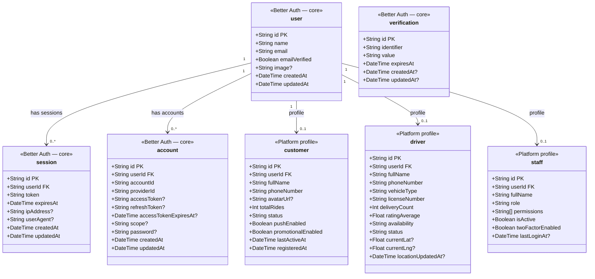
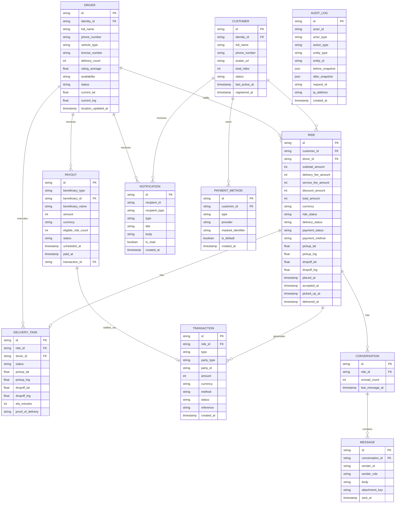
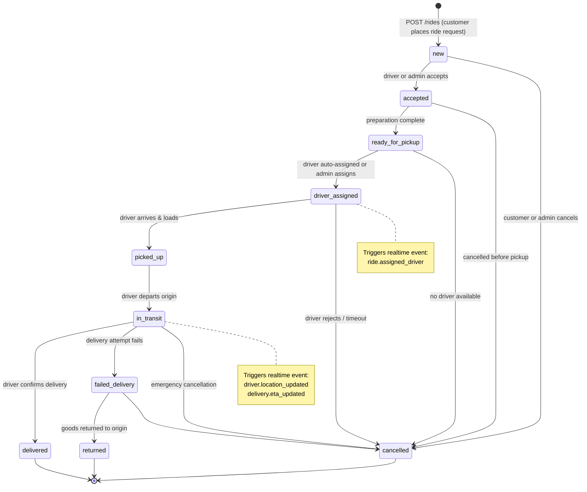
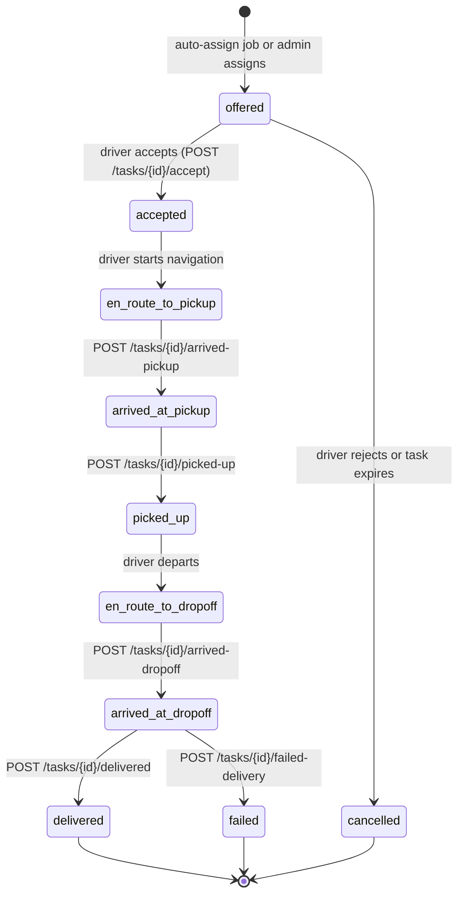
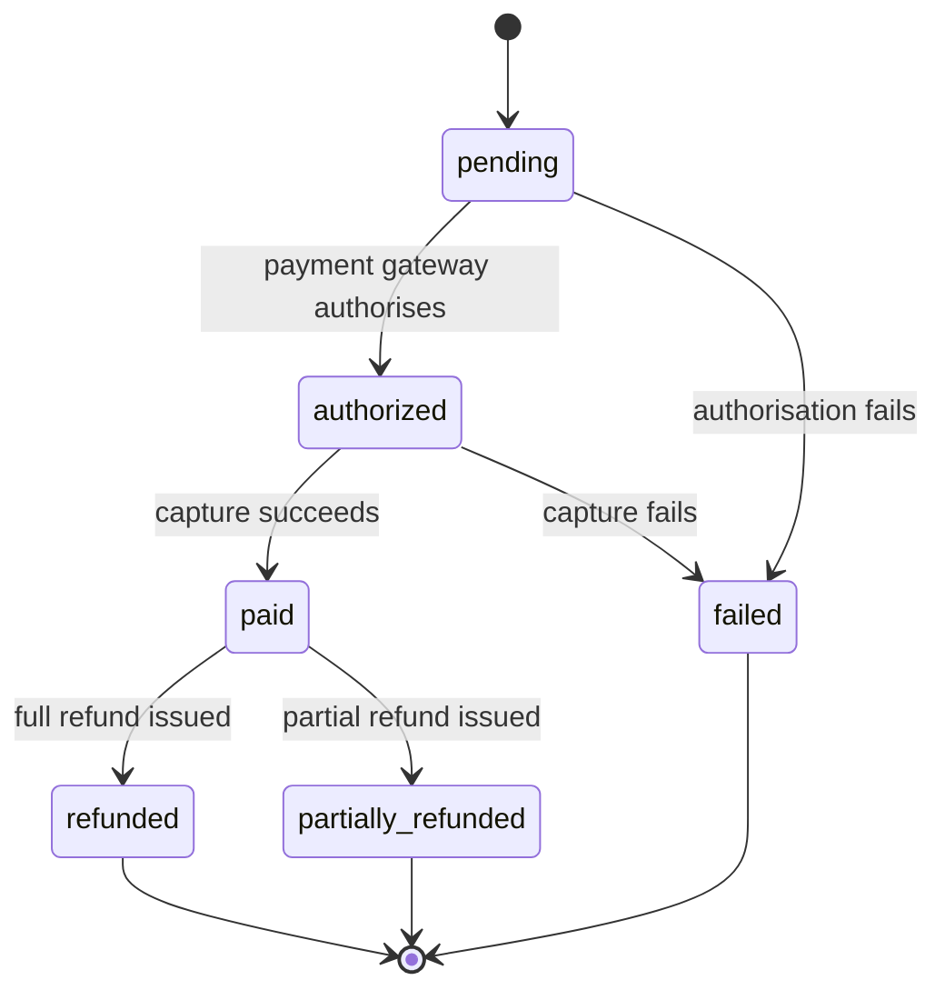
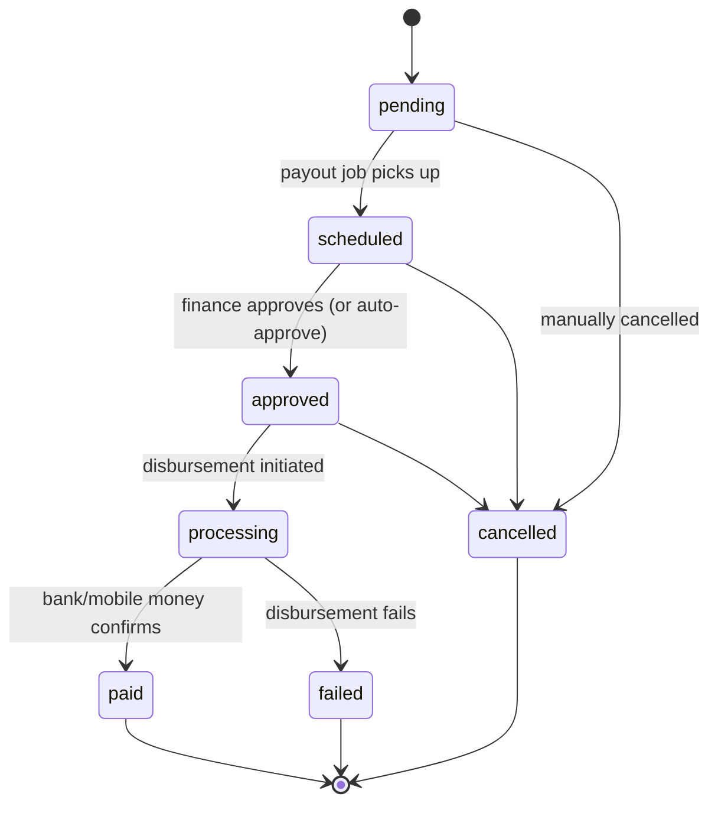
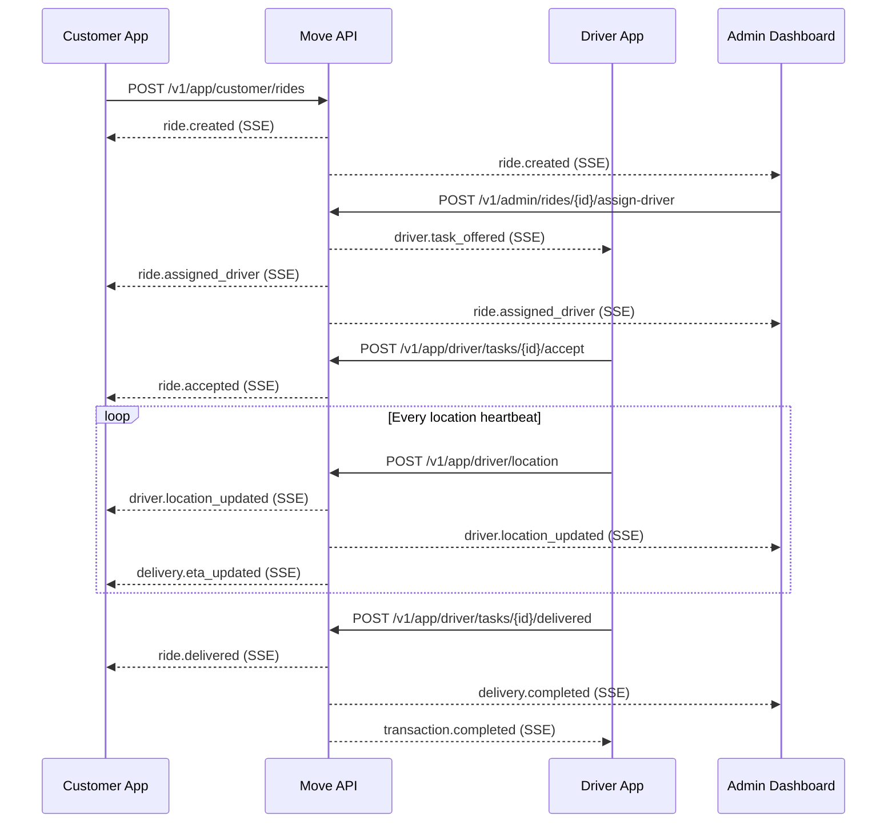
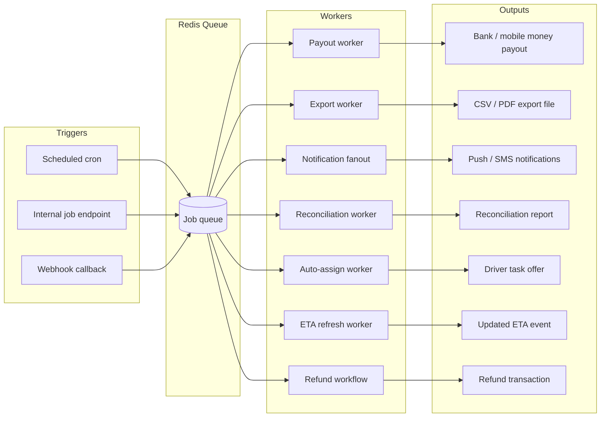

# Move Platform API Specification

> **Version:** v1  
> **Base URL:** `https://api.move.app/v1`  
> **Protocol:** HTTPS · JSON  
> **Timestamps:** ISO 8601 UTC  
> **Money:** Integer minor units + explicit currency field  
> **Pagination:** Cursor-based

---

## Table of Contents

1. [Platform Overview](#1-platform-overview)
2. [Backend Stack](#2-backend-stack)
3. [Authentication & Authorization](#3-authentication--authorization)
4. [Domain Model (ERD)](#4-domain-model-erd)
5. [State Machines](#5-state-machines)
6. [API Conventions](#6-api-conventions)
7. [App API — Customer Surface](#7-app-api--customer-surface)
8. [App API — Driver Surface](#8-app-api--driver-surface)
9. [Admin API](#9-admin-api)
10. [Internal API](#10-internal-api)
11. [Realtime Events](#11-realtime-events)
12. [Background Jobs](#12-background-jobs)
13. [Audit & Compliance](#13-audit--compliance)
14. [Treaty SDK Guidance](#14-treaty-sdk-guidance)

---

## 1. Platform Overview

The Move platform is a shared single-backend API that powers all first-party clients:

- **customer** — mobile app users who request relocation rides
- **driver** — partner users who accept and complete relocation tasks
- **staff** — internal operations, finance, support, and platform management

```
┌─────────────────────────────────────────────────────────┐
│                    Move Platform API                     │
│                  https://api.move.app                    │
├──────────────────┬───────────────────┬──────────────────┤
│   Customer App   │    Driver App     │  Admin Dashboard  │
│ /v1/app/customer │  /v1/app/driver   │    /v1/admin      │
└──────────────────┴───────────────────┴──────────────────┘
         ↕                  ↕                   ↕
┌─────────────────────────────────────────────────────────┐
│            Shared Domain · Shared DB · Shared Auth       │
│              /api/auth/*    /v1/internal/*               │
└─────────────────────────────────────────────────────────┘
```

**Design principles:**

- One shared domain model, one database, one auth system, one event bus
- Client-specific route groups with role-specific permission checks
- Core business logic must not be embedded inside client-only route handlers

---

## 2. Backend Stack

| Concern | Technology |
|---|---|
| Runtime | Bun |
| API framework | Elysia |
| Typed client generation | Treaty |
| Database | PostgreSQL |
| ORM | Drizzle ORM |
| Validation / contracts | Zod |
| Cache / queue | Redis |
| Background jobs | Redis-backed workers |
| Object storage | S3-compatible |
| Realtime | SSE or WebSockets via Elysia |
| API documentation | OpenAPI |

  ### 2.1 Backend app structure 
apps/api/src/
├─ index.ts
├─ app.ts
├─ plugins/
│  ├─ auth.ts
│  ├─ db.ts
│  ├─ permissions.ts
│  ├─ redis.ts
│  └─ realtime.ts
├─ modules/
│  ├─ auth/
│  ├─ admins/
│  ├─ customers/
│  ├─ drivers/
│  ├─ payouts/
│  ├─ notifications/
│  ├─ chat/
│  ├─ analytics/
│  └─ uploads/
├─ routes/
│  ├─ app/
│  ├─ admin/
│  └─ internal/
└─ workers/
```

---

## 3. Authentication & Authorization

### 3.1 Shared Auth Transport

All first-party clients authenticate via the shared Better Auth route surface:

```
POST   /api/auth/sign-up/email
POST   /api/auth/sign-in/email
GET    /api/auth/get-session
POST   /api/auth/sign-out
```

Role-specific customer and driver records are created outside the auth transport layer.

**App-level auth wrappers:**

```
POST   /v1/app/customer/auth/sign-up
POST   /v1/app/customer/auth/login
POST   /v1/app/driver/auth/sign-up
POST   /v1/app/driver/auth/login
```

### 3.2 Better Auth Schema & Principal Types

Better Auth owns four core tables (`user`, `session`, `account`, `verification`). Platform-specific profiles (`customer`, `driver`, `staff`) extend the `user` table via a `userId` foreign key — they are never stored inside Better Auth's own tables.



**How it works in practice:**

1. Sign-up hits `POST /api/auth/sign-up/email` — Better Auth creates a `user` row and a credential `account` row.
2. The platform app wrapper (`POST /v1/app/customer/auth/sign-up` or `/v1/app/driver/auth/sign-up`) then creates the corresponding `customer` or `driver` profile row linked via `userId`.
3. `GET /api/auth/get-session` returns the `session` + `user`. The platform resolves the principal type by joining against `customer`, `driver`, or `staff` on `userId`.
4. Staff accounts are created out-of-band (invitation-based or super-admin only) — the `staff` profile row is inserted after the `user` row is created.
5. The `verification` table is used by Better Auth for email verification tokens and password-reset flows.

### 3.3 Staff Roles & Permissions

| Role | Key Permissions |
|---|---|
| `admin` | All permissions |
| `operation` | `rides.read/update/cancel`, `drivers.read/write`, `dashboard.read` |
| `finance` | `transactions.read`, `payouts.read/write`, `rides.refund` |
| `support` | `rides.read/update`, `users.read`, `notifications.read/write` |
| `security` | `security.read/write`, `roles.read/write`, `exports.read/write` |

**Full permission set:** `dashboard.read` · `rides.read` · `rides.update` · `rides.cancel` · `rides.refund` · `users.read` · `drivers.read` · `drivers.write` · `transactions.read` · `payouts.read` · `payouts.write` · `notifications.read` · `notifications.write` · `settings.read` · `settings.write` · `roles.read` · `roles.write` · `security.read` · `security.write` · `exports.read` · `exports.write`

---

## 4. Domain Model (ERD)



---

## 5. State Machines

### 5.1 Ride Lifecycle



### 5.2 Driver Task Lifecycle



### 5.3 Payment Status



### 5.4 Payout Status



---

## 6. API Conventions

### 6.1 Response Envelope

All endpoints return the same envelope:

```json
{
  "data":  {},
  "meta":  {},
  "error": null
}
```

**Paginated response:**

```json
{
  "data": [],
  "meta": {
    "nextCursor": "cur_abc123",
    "hasMore": true,
    "total": 193
  },
  "error": null
}
```

**Error response:**

```json
{
  "data": null,
  "meta": { "requestId": "req_01JXYZ" },
  "error": {
    "code": "VALIDATION_ERROR",
    "message": "One or more fields are invalid.",
    "details": [
      { "field": "pickup.latitude", "message": "Required." }
    ]
  }
}
```

### 6.2 Common Query Parameters

| Parameter | Type | Description |
|---|---|---|
| `q` | string | Free-text search |
| `status` | string | Filter by status enum |
| `type` | string | Filter by type enum |
| `dateFrom` | ISO 8601 | Start date filter |
| `dateTo` | ISO 8601 | End date filter |
| `cursor` | string | Pagination cursor |
| `limit` | integer | Page size |
| `sortBy` | string | Field to sort by |
| `sortOrder` | `asc` \| `desc` | Sort direction |

### 6.3 Route Surface Architecture

```mermaid
graph TD
    subgraph Clients
        CA[Customer App]
        DA[Driver App]
        AD[Admin Dashboard]
        WK[Internal Workers]
    end

    subgraph App Surface
        ACS[/v1/app/customer/*]
        ADS[/v1/app/driver/*]
        ASS[/v1/app/shared/*]
        AUTH[/api/auth/*]
    end

    subgraph Admin Surface
        ADM[/v1/admin/*]
    end

    subgraph Internal Surface
        INT[/v1/internal/*]
    end

    subgraph Core Platform
        BL[Business Logic]
        DB[(PostgreSQL)]
        RD[(Redis)]
        S3[(S3 Storage)]
    end

    CA --> ACS
    CA --> ASS
    CA --> AUTH
    DA --> ADS
    DA --> ASS
    DA --> AUTH
    AD --> ADM
    AD --> AUTH
    WK --> INT

    ACS --> BL
    ADS --> BL
    ASS --> BL
    ADM --> BL
    INT --> BL

    BL --> DB
    BL --> RD
    BL --> S3
```

---

## 7. App API — Customer Surface

### 7.1 Shared Auth

| Method | Path | Description |
|---|---|---|
| `POST` | `/api/auth/sign-up/email` | Shared identity sign-up |
| `POST` | `/api/auth/sign-in/email` | Shared identity sign-in |
| `GET` | `/api/auth/get-session` | Get current session |
| `POST` | `/api/auth/sign-out` | Invalidate session |
| `POST` | `/v1/app/customer/auth/sign-up` | Create customer profile |
| `POST` | `/v1/app/customer/auth/login` | Customer app login wrapper |

**POST `/v1/app/customer/auth/sign-up` body:**

```json
{
  "email": "jackiejohn@gmail.com",
  "password": "••••••••",
  "fullName": "Jackie John",
  "phoneNumber": "+255678674667"
}
```

### 7.2 Customer Profile

| Method | Path | Description |
|---|---|---|
| `GET` | `/v1/app/customer/me` | Get authenticated customer profile |
| `PATCH` | `/v1/app/customer/me` | Update profile fields |
| `POST` | `/v1/app/customer/me/avatar` | Upload avatar (use presign flow) |
| `GET` | `/v1/app/customer/me/preferences` | Get notification preferences |
| `PATCH` | `/v1/app/customer/me/preferences` | Update preferences |

**Customer model:**

```json
{
  "id": "usr_0238",
  "fullName": "Jackie John",
  "email": "jackiejohn@gmail.com",
  "phoneNumber": "+255678674667",
  "avatarUrl": "https://cdn.move.app/users/usr_0238.jpg",
  "totalRides": 3,
  "lastActiveAt": "2026-03-17T08:22:00Z",
  "registeredAt": "2026-03-17T08:22:00Z",
  "status": "active",
  "notificationPreferences": {
    "pushEnabled": true,
    "promotionalEnabled": false
  }
}
```

### 7.3 Rides (Ride Requests)

| Method | Path | Description |
|---|---|---|
| `POST` | `/v1/app/customer/rides` | Place a relocation request |
| `GET` | `/v1/app/customer/rides` | List customer rides |
| `GET` | `/v1/app/customer/rides/{rideId}` | Get single ride |
| `POST` | `/v1/app/customer/rides/{rideId}/cancel` | Cancel a ride |
| `POST` | `/v1/app/customer/rides/{rideId}/repeat` | Re-place identical ride |
| `GET` | `/v1/app/customer/rides/{rideId}/tracking` | Live driver location & ETA |
| `GET` | `/v1/app/customer/rides/{rideId}/receipt` | Download receipt |

**POST `/v1/app/customer/rides` body:**

```json
{
  "pickup": {
    "latitude": -6.7727,
    "longitude": 39.2608,
    "label": "Kariakoo Market"
  },
  "dropoff": {
    "latitude": -6.7489,
    "longitude": 39.2768,
    "label": "Masaki Peninsula"
  },
  "paymentMethodId": "pm_001",
  "notes": "Fragile items — please handle carefully"
}
```

**Ride model:**

```json
{
  "id": "ride_2189",
  "customerId": "usr_0238",
  "driverId": "drv_1024",
  "subtotalAmount": 800000,
  "deliveryFeeAmount": 150000,
  "serviceFeeAmount": 50000,
  "discountAmount": 0,
  "totalAmount": 1000000,
  "currency": "TZS",
  "rideStatus": "in_transit",
  "deliveryStatus": "on_route",
  "paymentStatus": "paid",
  "paymentMethod": "mobile_money",
  "pickup": { "latitude": -6.7727, "longitude": 39.2608, "label": "Kariakoo Market" },
  "dropoff": { "latitude": -6.7489, "longitude": 39.2768, "label": "Masaki Peninsula" },
  "placedAt": "2026-03-17T05:22:00Z",
  "acceptedAt": "2026-03-17T05:25:00Z",
  "pickedUpAt": "2026-03-17T05:45:00Z",
  "deliveredAt": null
}
```

**GET `/v1/app/customer/rides/{rideId}/tracking` response:**

```json
{
  "data": {
    "driverLocation": { "latitude": -6.7601, "longitude": 39.2690 },
    "etaMinutes": 12,
    "deliveryStatus": "on_route",
    "taskStatus": "en_route_to_dropoff"
  }
}
```

### 7.4 Payment Methods

| Method | Path | Description |
|---|---|---|
| `GET` | `/v1/app/customer/payment-methods` | List saved methods |
| `POST` | `/v1/app/customer/payment-methods` | Add a payment method |
| `PATCH` | `/v1/app/customer/payment-methods/{paymentMethodId}` | Update method |
| `DELETE` | `/v1/app/customer/payment-methods/{paymentMethodId}` | Remove method |
| `POST` | `/v1/app/customer/payment-methods/{paymentMethodId}/default` | Set as default |
| `GET` | `/v1/app/customer/payments/{paymentId}` | Get payment status |
| `POST` | `/v1/app/customer/payments/{paymentId}/confirm` | Confirm pending payment |
| `POST` | `/v1/app/customer/payments/{paymentId}/retry` | Retry failed payment |

### 7.5 Shared App Services

#### Uploads

| Method | Path | Description |
|---|---|---|
| `POST` | `/v1/app/uploads/presign` | Get presigned S3 upload URL |
| `POST` | `/v1/app/uploads/complete` | Confirm upload finalised |

**POST `/v1/app/uploads/presign` body:**

```json
{
  "assetType": "avatar",
  "mimeType": "image/jpeg",
  "size": 204800
}
```

#### Notifications

| Method | Path | Description |
|---|---|---|
| `GET` | `/v1/app/shared/notifications` | List notifications (cursor paginated) |
| `POST` | `/v1/app/shared/notifications/{notificationId}/read` | Mark one as read |
| `POST` | `/v1/app/shared/notifications/read-all` | Mark all as read |
| `GET` | `/v1/app/shared/notification-preferences` | Get preferences |
| `PATCH` | `/v1/app/shared/notification-preferences` | Update preferences |

#### Conversations

| Method | Path | Description |
|---|---|---|
| `GET` | `/v1/app/shared/conversations` | List conversations |
| `POST` | `/v1/app/shared/conversations` | Open a conversation |
| `GET` | `/v1/app/shared/conversations/{conversationId}` | Get conversation |
| `GET` | `/v1/app/shared/conversations/{conversationId}/messages` | Paginated messages |
| `POST` | `/v1/app/shared/conversations/{conversationId}/messages` | Send message |
| `POST` | `/v1/app/shared/conversations/{conversationId}/attachments` | Attach file |
| `POST` | `/v1/app/shared/conversations/{conversationId}/read` | Mark as read |

**Conversation model:**

```json
{
  "id": "cnv_123",
  "rideId": "ride_2189",
  "participants": [
    { "userId": "usr_0238", "role": "customer", "name": "Jackie John" },
    { "userId": "drv_1024", "role": "driver",   "name": "John Peter" }
  ],
  "lastMessage": {
    "id": "msg_1",
    "body": "I am 5 minutes away.",
    "sentAt": "2026-04-05T08:05:00Z"
  },
  "unreadCount": 1
}
```

---

## 8. App API — Driver Surface

### 8.1 Auth

| Method | Path | Description |
|---|---|---|
| `POST` | `/v1/app/driver/auth/sign-up` | Register driver account |
| `POST` | `/v1/app/driver/auth/login` | Driver app login |

**POST `/v1/app/driver/auth/sign-up` body:**

```json
{
  "email": "johnpeter@example.com",
  "password": "••••••••",
  "fullName": "John Peter",
  "phoneNumber": "+255718920441",
  "vehicleType": "Canter",
  "licenseNumber": "DRV-100200"
}
```

### 8.2 Driver Profile & Documents

| Method | Path | Description |
|---|---|---|
| `GET` | `/v1/app/driver/me` | Get driver profile |
| `PATCH` | `/v1/app/driver/me` | Update profile |
| `POST` | `/v1/app/driver/documents` | Upload document |
| `GET` | `/v1/app/driver/documents` | List documents & approval status |

**Driver model:**

```json
{
  "id": "drv_1024",
  "fullName": "John Peter",
  "phoneNumber": "+255718920441",
  "avatarUrl": "https://cdn.move.app/drivers/drv_1024.jpg",
  "vehicleType": "Canter",
  "licenseNumber": "DRV-100200",
  "deliveryCount": 124,
  "ratingAverage": 5.0,
  "availability": "online",
  "status": "active",
  "currentLocation": {
    "lat": -6.7731,
    "lng": 39.2404,
    "updatedAt": "2026-04-04T08:00:00Z"
  }
}
```

### 8.3 Availability & Location

| Method | Path | Description |
|---|---|---|
| `POST` | `/v1/app/driver/availability` | Toggle `online` / `offline` |
| `POST` | `/v1/app/driver/location` | Push GPS coordinates (heartbeat) |

**POST `/v1/app/driver/location` body:**

```json
{
  "latitude": -6.7731,
  "longitude": 39.2404,
  "heading": 270,
  "speed": 40
}
```

> Triggers the `driver.location_updated` realtime event, consumed by the customer tracking view and admin dashboard.

### 8.4 Delivery Tasks

| Method | Path | Description |
|---|---|---|
| `GET` | `/v1/app/driver/tasks` | List tasks (offered, active, history) |
| `GET` | `/v1/app/driver/tasks/{taskId}` | Get task detail |
| `POST` | `/v1/app/driver/tasks/{taskId}/accept` | Accept offered task |
| `POST` | `/v1/app/driver/tasks/{taskId}/reject` | Reject offered task |
| `POST` | `/v1/app/driver/tasks/{taskId}/arrived-pickup` | Signal arrival at pickup |
| `POST` | `/v1/app/driver/tasks/{taskId}/picked-up` | Confirm items loaded |
| `POST` | `/v1/app/driver/tasks/{taskId}/arrived-dropoff` | Signal arrival at destination |
| `POST` | `/v1/app/driver/tasks/{taskId}/delivered` | Complete delivery |
| `POST` | `/v1/app/driver/tasks/{taskId}/failed-delivery` | Report failed delivery |
| `GET` | `/v1/app/driver/tasks/{taskId}/navigation` | Get turn-by-turn route |
| `POST` | `/v1/app/driver/tasks/{taskId}/contact-customer` | Open conversation with customer |

**DeliveryTask model:**

```json
{
  "id": "dlv_123",
  "rideId": "ride_2189",
  "driverId": "drv_1024",
  "status": "en_route_to_dropoff",
  "pickup": {
    "latitude": -6.7727,
    "longitude": 39.2608,
    "label": "Kariakoo Market"
  },
  "dropoff": {
    "customerId": "usr_0238",
    "name": "Jackie John",
    "latitude": -6.7489,
    "longitude": 39.2768,
    "label": "Masaki Peninsula"
  },
  "etaMinutes": 12,
  "proofOfDelivery": null
}
```

**POST `/v1/app/driver/tasks/{taskId}/delivered` body:**

```json
{
  "proofOfDelivery": "uploads/pod/dlv_123_proof.jpg"
}
```

### 8.5 Earnings

| Method | Path | Description |
|---|---|---|
| `GET` | `/v1/app/driver/earnings/summary` | Totals, pending payout, period breakdown |
| `GET` | `/v1/app/driver/earnings/history` | Per-ride earnings list |
| `GET` | `/v1/app/driver/payouts` | Payout history & statuses |

---

## 9. Admin API

### 9.1 Authentication

Admin authentication uses the shared Better Auth transport. Admin onboarding should be invitation-based or restricted to super-admin creation. RBAC is enforced after session resolution.

```
POST   /api/auth/sign-in/email
GET    /api/auth/get-session
POST   /api/auth/sign-out
```

### 9.2 Dashboard

| Method | Path | Description |
|---|---|---|
| `GET` | `/v1/admin/dashboard/overview` | Summary metrics, trends, recent rides |

**Query parameters:** `period=month\|week\|day`, `year`

**Response includes:**
- Metric cards (total rides, revenue, active drivers, active customers)
- User segment distribution
- Revenue vs target trend
- User activity trend
- Recent rides summary

### 9.3 Rides

#### Enums

**`rideStatus`:** `in_progress` · `completed` · `refunded` · `canceled`

**`deliveryStatus`:** `in_checking` · `picked` · `on_route` · `canceled` · `none`

#### Endpoints

| Method | Path | Description |
|---|---|---|
| `GET` | `/v1/admin/rides` | List all rides |
| `GET` | `/v1/admin/rides/summary` | Count & amount per status bucket |
| `GET` | `/v1/admin/rides/{rideId}` | Full ride detail |
| `PATCH` | `/v1/admin/rides/{rideId}` | Update ride fields |
| `POST` | `/v1/admin/rides/{rideId}/assign-driver` | Manually assign a driver |
| `POST` | `/v1/admin/rides/{rideId}/refund` | Initiate refund |
| `POST` | `/v1/admin/rides/bulk` | Bulk action on multiple rides |

**GET `/v1/admin/rides` query parameters:**

| Parameter | Type |
|---|---|
| `q` | string |
| `rideStatus` | enum |
| `deliveryStatus` | enum |
| `driverId` | string |
| `customerId` | string |
| `dateFrom` | ISO 8601 |
| `dateTo` | ISO 8601 |
| `cursor` | string |
| `limit` | integer |
| `sortBy` | string |
| `sortOrder` | `asc` \| `desc` |

**POST `/v1/admin/rides/{rideId}/assign-driver` body:**

```json
{ "driverId": "drv_1024" }
```

**POST `/v1/admin/rides/bulk` body:**

```json
{
  "rideIds": ["ride_001", "ride_002"],
  "action": "cancel"
}
```

Allowed actions: `cancel` · `mark_completed` · `assign_driver` · `request_refund` · `export`

### 9.4 Drivers

| Method | Path | Description |
|---|---|---|
| `GET` | `/v1/admin/drivers/metrics` | Total / active / online counts |
| `GET` | `/v1/admin/drivers` | List drivers |
| `GET` | `/v1/admin/drivers/{driverId}` | Driver profile + stats |
| `PATCH` | `/v1/admin/drivers/{driverId}` | Update driver record |
| `POST` | `/v1/admin/drivers/{driverId}/status` | Activate or suspend |
| `GET` | `/v1/admin/drivers/{driverId}/deliveries` | Delivery history |

**POST `/v1/admin/drivers/{driverId}/status` body:**

```json
{
  "status": "suspended",
  "reason": "Document verification failed"
}
```

### 9.5 Transactions

| Method | Path | Description |
|---|---|---|
| `GET` | `/v1/admin/transactions/metrics` | Volume, success rate, totals |
| `GET` | `/v1/admin/transactions` | List transactions |
| `GET` | `/v1/admin/transactions/{transactionId}` | Transaction detail |
| `POST` | `/v1/admin/transactions/{transactionId}/retry` | Retry failed transaction |

**Transaction model:**

```json
{
  "id": "txn_1046",
  "rideId": "ride_2002",
  "type": "payout",
  "partyType": "driver",
  "partyId": "drv_1024",
  "amount": 125000000,
  "currency": "TZS",
  "method": "bank",
  "status": "completed",
  "reference": "bank_trf_333",
  "createdAt": "2026-02-12T10:00:00Z"
}
```

### 9.6 Payouts

| Method | Path | Description |
|---|---|---|
| `GET` | `/v1/admin/payouts/metrics` | Volume and pending amounts |
| `GET` | `/v1/admin/payouts` | List payouts |
| `GET` | `/v1/admin/payouts/{payoutId}` | Payout detail |
| `POST` | `/v1/admin/payouts/{payoutId}/pay` | Execute single payout |
| `GET` | `/v1/admin/payouts/{payoutId}/transactions` | Linked transactions |
| `POST` | `/v1/admin/payouts/batches` | Create a batch payout run |
| `POST` | `/v1/admin/payouts/batches/{batchId}/approve` | Approve and execute batch |

**Payout model:**

```json
{
  "publicId": "PAYOUT-1001",
  "beneficiaryType": "driver",
  "beneficiaryId": "drv_1024",
  "beneficiaryName": "John Peter",
  "amount": 12000000,
  "currency": "TZS",
  "eligibleRideCount": 15,
  "status": "paid",
  "scheduledAt": "2026-02-12T00:00:00Z",
  "paidAt": "2026-02-12T11:00:00Z",
  "transactionId": "txn_1046"
}
```

### 9.7 Admin Notifications

| Method | Path | Description |
|---|---|---|
| `GET` | `/v1/admin/notifications` | List admin notifications |
| `GET` | `/v1/admin/notifications/summary` | Unread count by type |
| `POST` | `/v1/admin/notifications/{notificationId}/read` | Mark one as read |
| `POST` | `/v1/admin/notifications/read-all` | Mark all as read |

---

## 10. Internal API

Used for webhooks, background jobs, and trusted service-to-service operations. Secured with service credentials — not exposed to any first-party client app.

### 10.1 Payment Webhooks

| Method | Path | Description |
|---|---|---|
| `POST` | `/v1/internal/payments/webhooks/mobile-money` | Mobile money provider callback |
| `POST` | `/v1/internal/payments/webhooks/bank` | Bank transfer callback |
| `POST` | `/v1/internal/payments/webhooks/card` | Card payment callback |

> All webhook endpoints verify an HMAC signature from the provider shared secret before processing.

### 10.2 Background Job Triggers

| Method | Path | Description |
|---|---|---|
| `POST` | `/v1/internal/jobs/payouts/run` | Trigger payout execution job |
| `POST` | `/v1/internal/jobs/exports/run` | Trigger data export generation |
| `POST` | `/v1/internal/jobs/reconciliation/run` | Trigger reconciliation sweep |
| `POST` | `/v1/internal/jobs/notifications/fanout` | Fan out queued notifications |
| `POST` | `/v1/internal/jobs/delivery/auto-assign` | Auto-assign unassigned rides to available drivers |

### 10.3 Reconciliation

| Method | Path | Description |
|---|---|---|
| `GET` | `/v1/internal/reconciliation/transactions` | List unreconciled transactions |
| `POST` | `/v1/internal/reconciliation/transactions/{transactionId}/resolve` | Mark transaction reconciled |

### 10.4 System Events

| Method | Path | Description |
|---|---|---|
| `POST` | `/v1/internal/events/ride-updated` | Internal ride state change trigger |
| `POST` | `/v1/internal/events/delivery-updated` | Internal delivery state change trigger |
| `POST` | `/v1/internal/events/notification-created` | Enqueue notification for fanout |

---

## 11. Realtime Events

Transport: **SSE or WebSockets** via Elysia. Events are consumed by the customer app, driver app, and admin dashboard.



### Full Event Catalog

| Event | Consumers |
|---|---|
| `ride.created` | Admin |
| `ride.updated` | Customer · Admin |
| `ride.accepted` | Customer |
| `ride.assigned_driver` | Customer · Admin |
| `ride.delivered` | Customer · Admin |
| `driver.location_updated` | Customer · Admin |
| `driver.task_offered` | Driver |
| `driver.task_expired` | Driver |
| `delivery.eta_updated` | Customer |
| `delivery.completed` | Admin |
| `notification.created` | Customer · Driver · Admin |
| `notification.read` | Customer · Driver · Admin |
| `message.created` | Customer · Driver |
| `conversation.read` | Customer · Driver |
| `transaction.completed` | Driver · Admin |
| `payout.paid` | Driver · Admin |
| `settings.updated` | Admin |

---

## 12. Background Jobs



| Worker | Trigger | Description |
|---|---|---|
| Payout execution | Scheduled / `/jobs/payouts/run` | Process approved payouts to drivers via bank or mobile money |
| Export generation | On demand / `/jobs/exports/run` | Generate CSV or PDF report files to S3 |
| Notification fanout | `/jobs/notifications/fanout` | Deliver queued push/SMS notifications to recipients |
| Reconciliation | Scheduled / `/jobs/reconciliation/run` | Match platform records against provider transaction logs |
| Delivery auto-assign | `/jobs/delivery/auto-assign` | Match unassigned rides to nearest available driver |
| Route & ETA refresh | Continuous | Recalculate ETA as driver location updates |
| Refund approval | Event-driven | Orchestrate multi-step refund approval flow |
| Scheduled summaries | Scheduled | Generate daily/weekly summary reports for staff |

---

## 13. Audit & Compliance

The following actions must produce an audit log entry:

- Admin login / logout
- App auth events for sensitive flows
- Ride status changes
- Driver assignment changes
- Refunds
- Payout approvals and executions
- Settings changes
- Admin account creation / update / deletion
- Security policy changes
- Driver document approvals

**Audit log schema:**

```json
{
  "id": "aud_001",
  "actorId": "adm_123",
  "actorType": "staff",
  "actionType": "ride.status_changed",
  "entityType": "ride",
  "entityId": "ride_2189",
  "beforeSnapshot": { "rideStatus": "accepted" },
  "afterSnapshot":  { "rideStatus": "cancelled" },
  "requestId": "req_01JXYZ",
  "ipAddress": "196.216.1.10",
  "createdAt": "2026-04-04T08:42:00Z"
}
```

---

## 14. Treaty SDK Guidance

The Elysia Treaty SDK is organised by surface:

```typescript
// SDK surfaces
sdk.admin
sdk.app.customer
sdk.app.driver

// Each surface exposes typed methods for:
// - route params
// - query params
// - request bodies
// - response envelopes
// - error types

// Example usage
const { data, error } = await sdk.app.customer.rides.post({
  pickup:  { latitude: -6.7727, longitude: 39.2608 },
  dropoff: { latitude: -6.7489, longitude: 39.2768 },
  paymentMethodId: "pm_001",
});

const { data: ride } = await sdk.admin.rides({ rideId: "ride_2189" }).get();
```

---

*This specification is the canonical cross-client platform contract for the Move relocation platform. All admin and app clients should consume the shared backend through Treaty. Core business logic must live in the shared platform layer — never in client-specific route handlers.*
